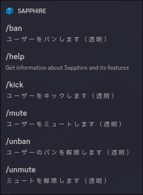
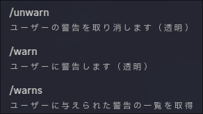
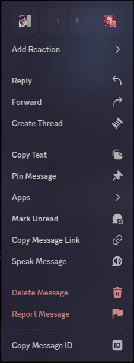
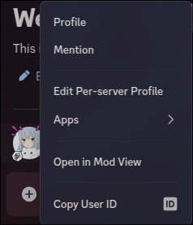
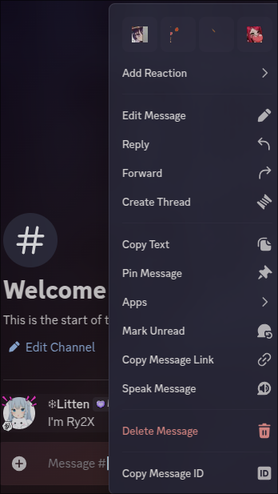
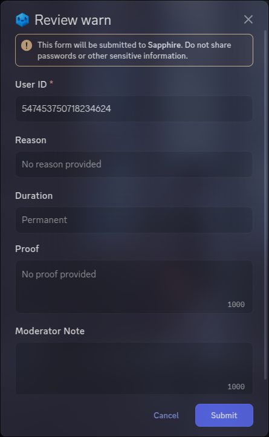
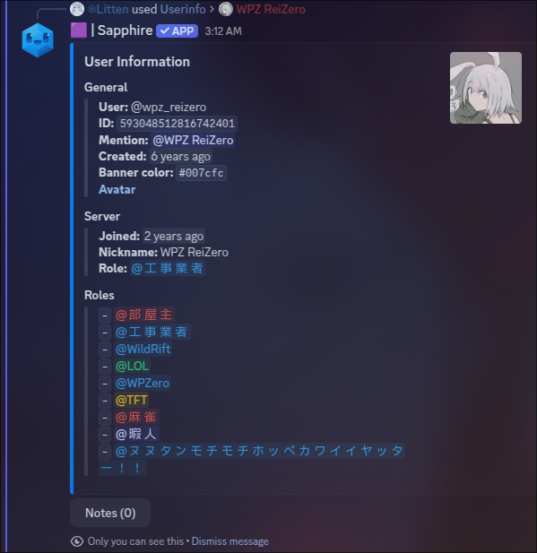
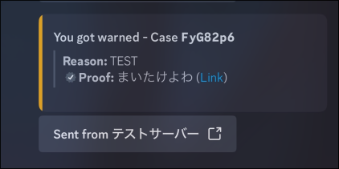

# Sapphire について 1

Sapphire は Discord のモデレーションに特化した機能を備えた BOT です。
これは、24/7 で稼働しサーバーの監視、管理を行うことができます。

## 今回有効化している機能 - モデレーション

### スラッシュコマンドでの使用

`/`を入力すると、利用可能なコマンドのリストが表示されます。

> [!NOTE]
> わっつぁ スラッシュコマンド? [チェックふぁきん無料資料！！](https://support-apps.discord.com/hc/en-us/articles/26501837786775-Slash-Commands-FAQ)

コマンドの一覧画像

| コマンド  |     日本語     | 説明                                       | デフォルト期間 | 透明 |
| :-------- | :------------: | :----------------------------------------- | :------------: | :--: |
| `/ban`    |      バン      | ユーザーをサーバーから永久に追放します。   |      永久      |  ✅  |
| `/kick`   |     キック     | ユーザーをサーバーから一時的に追放します。 |       -        |  ✅  |
| `/mute`   |    ミュート    | ユーザーをサーバー内でミュートします。     |     30 分      |  ✅  |
| `/warn`   |      警告      | ユーザーに警告を発行します。               |      永久      |  ✅  |
| `/unban`  |    バン解除    | ユーザーのサーバーからの追放を解除します。 |       -        |  ✅  |
| `/unmute` | 　ミュート解除 | ユーザーのミュートを解除します。           |       -        |  ✅  |
| `/unwarn` |    警告解除    | ユーザーの警告を解除します。               |       -        |  ✅  |
| `/warns`  |    警告一覧    | ユーザーの警告を一覧表示します。           |       -        |  ❌  |

> [!WARNING]
>
> `/warns`コマンドは透明ではありません。モデレーションチャンネルのみで使用して下さい。
>
> これらのコマンドは、サーバーの管理者または適切な権限 `BAN_MEMBER`を持つユーザーのみが使用できます。

> [!TIP]
>
> 期間は`duration`オプションで変更できます。
> 例：`/mute @user 1h reason`（1 時間ミュート）
>
> 書式は`1m`（1 分）、`1h`（1 時間）、`1d`（1 日）の形式で指定できます。

> [!TIP]
>
> コマンドの「透明」が有効な場合、コマンド実行者の名前や実行結果はモデレーター以外は確認できません。
> 逆に言えば透明が無効な場合は、コマンド実行者やその結果が全てのメンバーに表示されます。

> [!IMPORTANT]
>
> `reason`オプションは、必ず入力してください。入力がない場合、無効になる場合があります。

### コンテキストメニューからの使用

ユーザーやメッセージを右クリックすると表示されるコンテキストメニューの `Apps` を使用して、モデレーションコマンドを実行できます。

コンテキストメニューの画像

> [!TIP]
>
> この画像の`Apps`に該当するメニューからコマンドを実行できます。

| コマンド            |     日本語     | 説明                                                     |     使用可能場所     | 透明 |
| :------------------ | :------------: | :------------------------------------------------------- | :------------------: | :--: |
| `/ban`              |      バン      | ユーザーをサーバーから永久に追放します。                 | ユーザー・メッセージ |  ✅  |
| `/kick`             |     キック     | ユーザーをサーバーから一時的に追放します。               | ユーザー・メッセージ |  ✅  |
| `/mute`             |    ミュート    | ユーザーをサーバー内でミュートします。                   | ユーザー・メッセージ |  ✅  |
| `/warn`             |      警告      | ユーザーに警告を発行します。                             | ユーザー・メッセージ |  ✅  |
| `/purge until here` | メッセージ削除 | 現在のメッセージから指定した数のメッセージを削除します。 |      メッセージ      |  ✅  |
| `/user information` |  ユーザー情報  | ユーザーの情報を表示します。                             |       ユーザー       |  ✅  |

 使用可能場所について 

- ユーザー：ユーザーの名前を右クリックして表示されるメニューから実行できます。
  > 
- メッセージ：メッセージの右クリックメニューから実行できます。
  > 

##### ・`ban`、`kick`、`mute`、`warn` コマンドの使用方法

ユーザー・メッセージのいづれかの方法でこれらのコンテキストメニューを使用すると、以下のようなダイアログが表示されます。

ダイアログの画像

このダイアログは、選択したユーザーやメッセージに対してモデレーションアクションを実行するための詳細なオプションを提供します。
大体のコマンドは、以下のようなオプションを含んでいます。

| オプション名     | 説明 　　　　　　　　　　　　　　　　　　　          | 💡Hint                                               |
| :--------------- | :--------------------------------------------------- | :--------------------------------------------------- |
| `userID` 　　    | 対象のユーザーを選択します。                         | 自動で入力されます。                                 |
| `duration` 　    | アクションの有効期間を指定します。例：`1h`（1 時間） | スラッシュコマンドと同様                             |
| `reason` 　　    | アクションの理由を入力します。必須です。             | 理由は必ず入力してください。                         |
| `proof` 　　     | アクションの証拠を提供するためのオプションです。     | ユーザーから実行した場合はなるべく提供してください。 |
| `moderator note` | モデレーターのメモを入力します。                     | 後で事実確認などに困らないためのオプションです。     |

> [!TIP]
>
> `proof` オプションの内容は、相手へ通知されるので公平性が求められます。
>
> 例えば、`mute` コマンドで `proof` に「スパム行為」と入力すると、相手は「スパム行為」と通知されます。
>
> そのため、`proof` は常に事実に基づいた内容を入力してください。

##### ・`purge until here` コマンドの使用方法

このメニューコマンドは、選択したメッセージから現在までのメッセージを削除するためのものです。

> [!TIP]
>
> 現在が PM8:00 で、選択したメッセージが PM7:00 のものであれば、PM7:00 から PM8:00 までのメッセージを削除します。
>
> 逆に、現在が PM8:00 で、選択したメッセージが PM8:00 のものであれば、削除されるのはそのメッセージのみです。

動画デモ

##### ・`user information` コマンドの使用方法

このコマンドは、選択したユーザーの情報を表示します。

> [!TIP]
> こんな感じだよ！
>
> 

### ユーザーにはどう見えるのか

モデレーションコマンドを実行した場合、ユーザーには以下のように表示されます。
例は`warn`コンテキストコマンドを使用した場合です。[^1]

[^1]: Special thanks to **広瀬ヌヌ** for the image.
