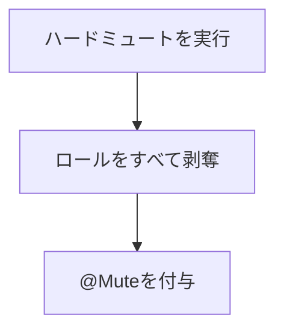
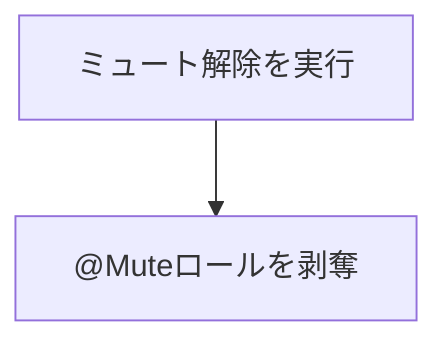

# ハードミュートの運用

> [!NOTE]
> ハードミュートについて
> これは、対象ユーザーのサーバー内での言動を完全に禁止する機能です。
>
> この機能を使用すると、ユーザーはサーバー内で`#迷える子羊に聞かせるレクイエム`チャンネル**のみ**が見えるようになります。
>
> そのため、他のチャンネルでの発言やリアクションは一切できなくなります。
> また、当該チャンネルにおいても発言はできません。

通常はこれにアピールコマンドを組み合わせることで、ユーザーが自らの行動を見直すきっかけを提供します。

> [!CAUTION]
> ハードミュートは特殊な操作なため[ここを読んで](#ハードミュートの影響)ユーザーに与える影響をよく理解してから使用してください。

## ハードミュートの操作

ハードミュートは`@carl-bot`を使用して行います。

`@sapphire`での運用ではなくなるので、`ハードミュート`の運用はこのドキュメントにまとめます。

### ハードミュートの実行

`@carl-bot`を使用して、以下のコマンドを実行します。

```
/moderation hardmute
```

- オプション
  `member:<ユーザー> reason:<理由>`

### ハードミュートの解除

`@carl-bot`を使用して、以下のコマンドを実行します。

```
/moderation unmute
```

- オプション
  `member:<ユーザー> reason:<理由>`

> [!NOTE]
> <ユーザー>は、ミュートしたいユーザーの名前や ID を指定します。
> 基本的には自動補完が利用できます。

> [!IMPORTANT]
>
> `reason`は必ず入力してください。

## ハードミュートの影響

ハードミュートは以下のようなワークフローで動作します。



すべてのロールを剥奪し、@Mute ロールを付与することで、ユーザーは`#迷える子羊に聞かせるレクイエム`チャンネルのみが見えるようになります。

ただし、`/moderation unmute`コマンドには、剥奪したロールを復元する機能はありません。
そのため、ハードミュートを解除した後は、新規ユーザーと同じ状態になります。

`@carl-bot`の`/moderation unmute`コマンドは以下のようなワークフローで動作します。



### ミュートされたときどう見えるか

ミュートされたユーザーは、以下のように表示されます。

チャンネル一覧には`#迷える子羊に聞かせるレクイエム`チャンネルのみが表示され、他のチャンネルは一切見えなくなります。
また、そのチャンネル内でも一切の発言や新規リアクションはできません。


